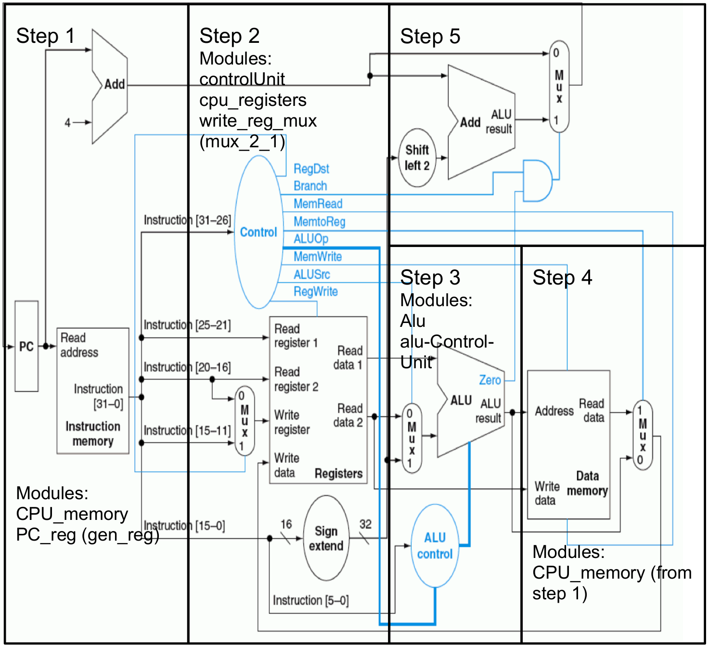

# Lab 02 - Arithmetic and Logic Unit (ALU) for MIPS
 ## Introduction

This lab will be an introduction to MIPS instruction formats and it's datapath 
components, in this case the Arithmetic/Logic Unit (ALU). You will also be 
getting familiar with the using Digital to test and debug your designs. The 
Verilog portion of this lab is to implement the MIPS ALU.

ALUs are hardware circuits that perform the arithmetic computations within a 
processor. They support multiple operations like addition, subtraction, 
multiplication, division, square roots, etc. The hardware logic to perform 
these operations can vary widely based on the approach used (Carry-Lookahead vs 
Ripple-Carry adder) or the data types supported (Integer, Float, Double). An 
ALU could even supply multiple versions of the same operation. They are not 
limited to only arithmetic operations. They can support bitwise operations, 
like AND, OR, and NOT. Input data and control bits are sent to the ALU. The 
control bits specify an operation (OPCODE), and the ALU redirects the inputs to 
the corresponding functional circuit. When the computation completes the result 
is output along with extra data about the operation (overflow, underflow, 
carryouts, etc.)

### The MIPS Datapath

To help your understanding of the components used in this lab, look at the datapath
diagram below. The compenents we are interested in are the Controller, ALU Control,
and ALU.

### Insturction Formats

To better understand the design of the MIPS ALU its important to understand
the MIPS instruction formats. To re-familiarize yourself here's a good online
resource: [MIPS Instruction Formats](http://www.cs.kzoo.edu/cs230/Resources/MIPS/MachineXL/InstructionFormats.html)

The main instruction format we are dealing with here in the ALU is the R-format.
These instructions involve register operands (hence the name R-format) that 
perform basic math operation in the ALU. Below is an example of an `add` 
instruction with the source registers `$s1` and `$s2` and the destination
register `$s0`.

|op    |rs   |rt   |rd   |shamt|funct |
|------|-----|-----|-----|-----|------|
|000000|10001|10010|10000|00000|100000|

While you can look up the meaning of each of the fields in the resource linked
above, the only one we are concerned with is the `funct` field. This field 
tells the `alu_control` component of the datapath which math operation the 
ALU should execute. It is the job of this component to translate that value
to the proper control value for the `alu`. This component has been provided
as part of this lab for you.

The only other pertinent instructions use the I-format. The instruction we
care about are the `lw` and `sw` instructions. These two instructions use
the ALU to compute effective addresses. The MIPS controller will indicate
that either of these two instructions need the ALU by assigning the 
value `0` or `1` to `alu_op`. This functionality is implemented for you in
`alu_control.v` 

### Getting started

As with Lab 01, you will create a repository using the original GitHub 
repository as a template. 

To create your repository from the template, got to "Use this template" -> 
"Create a new repository". On the next page, name your new repository, 
Lab02-ALU is a good choice. Be sure to select Private to ensure that others 
cannot see this repository. Any repository that is public will have points 
deducted from it. This is easily fixable if you forget, and you can always 
submit to Gradescope after changing to get full credit. Finally, click on 
"Create repository from template", and you're ready to go.

Additionally, you will test your design in Digital using 
[mips_alu.dig](./mips_alu.dig). This file uses your implementation of the ALU
and the supplied implementation of the ALU controller in 
[alu_control.v](./alu_control.v). All the wiring is already done and the tests
have been created for you. All you need to do is run the tests and verify that
your implementation of the ALU is correct. Once all the tests are passing, you
will write these same tests in the Verilog test bench. The table below has the
inputs for 22 tests and the expected outputs if the ALU is designed correclty.

#### Test Cases

|alu_op |instr_5_0 | A          | B          | zero | result     |
|-------|----------|------------|------------|------|------------|
| 2     | 0x24     | 0x1111     | 0xffff     | 0    | 0x1111     |
| 2     | 0x24     | 0x0000     | 0xffff     | 1    | 0x0000     |
| 2     | 0x25     | 0x1111     | 0xffff     | 0    | 0xffff     |
| 2     | 0x25     | 0x0000     | 0x0000     | 1    | 0x0000     |
| 2     | 0x20     | 0x0001     | 0xffff     | 0    | 0x10000    |
| 2     | 0x20     | 0x1111     | 0xffff     | 0    | 0x11110    |
| 2     | 0x20     | 0x0001     | 0xffffffff | 1    | 0x0000     |
| 2     | 0x20     | 0x0001     | 0xfffffffe | 0    | 0xffffffff |
| 2     | 0x22     | 0x0001     | 0xffffffff | 0    | 0x0002     |
| 2     | 0x22     | 0xffffffff | 0x0001     | 0    | 0xfffffffe |
| 2     | 0x22     | 0xffffffff | 0xffffffff | 1    | 0x0000     |
| 2     | 0x22     | 0x0001     | 0x0001     | 1    | 0x0000     |
| 2     | 0x2A     | 0x0002     | 0x0002     | 1    | 0x0000     |
| 2     | 0x2A     | 0x0002     | 0x0001     | 1    | 0x0000     |
| 2     | 0x2A     | 0x0001     | 0x0002     | 0    | 0x0001     |
| 2     | 0x2A     | 0xffffffff | 0x0001     | 0    | 0x0001     |
| 2     | 0x2A     | 0x0001     | 0xffffffff | 1    | 0x0000     |
| 2     | 0x27     | 0x1111     | 0xffff     | 0    | 0xffff0000 |
| 2     | 0x27     | 0x0000     | 0x0000     | 0    | 0xffffffff |
| 0     | 0x27     | 0x0001     | 0xffff     | 0    | 0x10000    |
| 1     | 0x2A     | 0xffff     | 0x0001     | 0    | 0xfffe     |
| 1     | 0x24     | 0x0001     | 0x0001     | 1    | 0x0000     |

## Deliverables

For this lab you are expected to build an ALU that supports arithmetic 
operations for the MIPS insturctions lw, sw, add, sub, and, or, nor, lt using the
template provided (alu.v) in the template repository. Additionally, you will 
submit your test bench in lab02_tb.v that implements and passes all the tests
in the table above.

### ALU Specification

- The file name ​**must**​ be named "`alu.v`​"
- The module name ​**must**​ be named "`alu`​"
- The module ​**must**​ ​register​ all outputs (​`reg`​)
- The module ​**must**​ have input/output ports with the **​EXACT**​ names listed below
- The test bench file name ​**must**​ be named "`lab01_tb.v`​"

|Inputs       |Size    |Direction|Description              |
|-------------|--------|---------|-------------------------|
|`alu_control`|4-bits  |input    | ALU Operation           |
|`A`          |32-bits |input    | Int input               |
|`B`          |32-bits |input    | Int input               |
|`zero`       |1-bit   |output   | 0 if result is 0        |
|`result`     |32-bits |output   | Result of ALU operation |

- The ALU module **​must**​ support the operations listed below

|Operation       |Control|
|----------------|-------|
|bit-wise AND    |b0000  |
|bit-wise OR     |b0001  |
|ADD             |b0010  |
|SUBTRACT        |b0110  |
|Less Than       |b0111  |
|bit-wise NOR    |b1100  |

The `​zero`​ port should be '​1​' when the ​`result`​ port is all zeros. Furthermore, for all operations above, the operands and result are **signed**.

### Writing the Test-Bench

Next, you will write the test-bench ([lab02_tb.v](./lab02_tb.v)) for the ALU 
you will be designing. The test-bench should include tests you see in the table 
above in the Test Cases section of this lab write-up. The first test case is 
already in the test bench. You will then use that code to implement the rest of 
the tests above.

### The Lab Report

Now create a file name REPORT.md and use GitHub markdown to write your lab 
report. This lab report will be short and contains only two sections. The 
first section will provide all the values give in the test cases table as
decimal signed integers. Just copy the table and replace all the hexadecimal 
values their correct decimal value. The numbers are given in this table in
two's complement form. If you don't remember this format you can look it up
on Google.

The second part of your report will briefly state any issues you encountered
while completing this lab. Issues like bugs or test cases that didn't pass. 
Also describe any fixes. You may also include feedback about this lab such as
pointing out errors in the lab write-up or suggestions for improvements.

Make sure to add this file to your repository and the commit and push the 
repository to GitHub. You'll submit your lab to Gradescrope using the GitHub 
repository.

## Submission:

Each student **​must**​ turn in their repository from GitHub to Gradescope. The contents of which should be:
- A REPORT.md file with your name and email address, and the content described above
- All Verilog file(s) used in this lab (implementation and test benches).

**If your file does not synthesize or simulate properly, you will receive a 0 on the lab.**
